# Grafovi Arhitekture Sustava - AI Language Tutor

## Graf 1: High-Level Arhitektura (Preporučeno za prezentaciju)

---

## Graf 2: Detaljna Tehnička Arhitektura

---

<## Graf 3: Data Flow - Chat Tutoring

```mermaid
sequenceDiagram
    participant U as Student
    participant FE as Next.js Frontend
    participant BE as FastAPI Backend
    participant PG as PostgreSQL
    participant NEO as Neo4j
    participant AI as AI Router
    participant LLM as OpenAI/Gemini
    
    U->>FE: Unos poruke u chat
    FE->>FE: Validacija i priprema
    FE->>BE: POST /api/v1/conversations/sessions/{id}/messages<br/>(JWT Token)
    
    BE->>BE: Verifikacija JWT
    BE->>PG: Spremi korisničku poruku<br/>(conversation_messages)
    
    BE->>NEO: Semantičko pretraživanje<br/>(Pronađi relevantne koncepte)
    NEO-->>BE: Vraća povezane gramatičke obrasce<br/>i vokabular
    
    BE->>BE: Generiraj embedding za poruku<br/>(pgvector ili AI provider)
    
    BE->>AI: Route request<br/>(task_type, complexity)
    AI->>AI: Odaberi optimalni model<br/>(cost, performance, task)
    
    AI->>LLM: Generate reply<br/>(prompt + context + knowledge)
    LLM-->>AI: Streaming response<br/>(tokens + metadata)
    
    AI-->>BE: Reply payload<br/>(content, tokens_used, model)
    
    BE->>PG: Spremi AI odgovor<br/>(conversation_messages + metadata)
    BE->>PG: Ažuriraj analytics<br/>(conversation_analytics)
    
    BE-->>FE: Stream SSE<br/>(event: message, data: tokens)
    FE->>FE: Render streaming text
    FE-->>U: Prikaži AI odgovor u real-time
    
    Note over BE,PG: Embedding se generira i sprema<br/>za buduće semantičko pretraživanje
    Note over BE,NEO: Graf znanja se koristi za<br/>personalizaciju konteksta
```

---

## Graf 4: Graf Znanja - Struktura

---

## Graf 5: Layered Architecture (Pojednostavljen)

---

## Graf 6: Komponente i Tehnologije (Mindmap)

---

## Kako Generirati Grafove

### Opcija 1: Mermaid Live Editor (Preporučeno)
1. Idite na: https://mermaid.live/
2. Kopirajte bilo koji graf iznad
3. Graf će se automatski generirati
4. Kliknite "Actions" → "Download PNG/SVG" za eksport

### Opcija 2: VS Code
1. Instalirajte ekstenziju "Markdown Preview Mermaid Support"
2. Otvorite ovaj fajl u VS Code
3. Grafovi će se automatski renderirati u preview modu

### Opcija 3: GitHub
1. Uploadajte ovaj fajl na GitHub
2. GitHub automatski renderira Mermaid grafove u markdown fajlovima

### Opcija 4: Online Tools
- https://mermaid-js.github.io/mermaid-live-editor/
- https://kroki.io/ (podržava Mermaid)
- https://www.diagrams.net/ (može importati Mermaid)

### Opcija 5: PowerPoint/Google Slides
1. Generirajte PNG/SVG iz Mermaid Live Editor
2. Importajte u PowerPoint ili Google Slides
3. Ili koristite Mermaid add-on za Google Slides

---

## Preporuke za Prezentaciju

### Za Slide:
- **Graf 1 (High-Level)** - Najbolji za uvod u arhitekturu
- **Graf 3 (Data Flow)** - Prikazuje kako sustav radi u praksi
- **Graf 4 (Graf Znanja)** - Vizualizacija strukture znanja

### Za Dokumentaciju:
- **Graf 2 (Detaljna)** - Kompletan tehnički pregled
- **Graf 5 (Layered)** - Pojednostavljena arhitektura
- **Graf 6 (Mindmap)** - Pregled tehnologija

---

## Prilagođavanje Grafova

Svi grafovi su u Mermaid formatu i mogu se lako mijenjati:
- Promjena boja: `style NODE fill:#color`
- Dodavanje čvorova: `NODE[Label]`
- Dodavanje relacija: `NODE1 --> NODE2`
- Promjena tipa grafa: `graph TB` → `graph LR` → `sequenceDiagram`

---

**Kreirano:** 6. studenog 2025.  
**Za:** TheCUC Konferencija, Rovinj, 7. studenog 2025.

