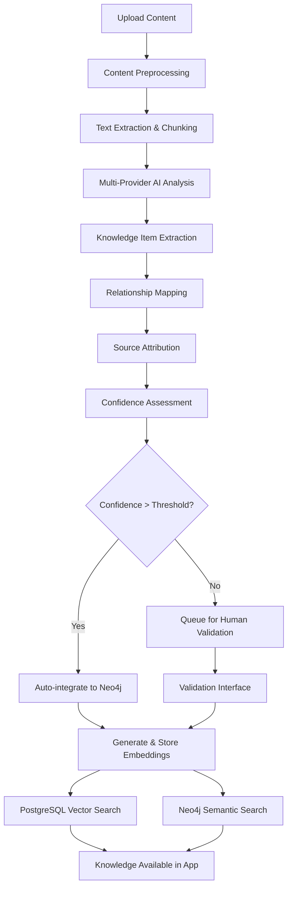

# AI-Powered Content Analysis System - Updated Architecture

## 🎯 Overview

The Content Analysis System is an intelligent endpoint that automatically processes Japanese grammar textbooks, articles, and educational content to extract new grammar points, vocabulary, and their relationships, then seamlessly integrates them into the knowledge graph with proper source attribution.

**Simplified Architecture**: Uses PostgreSQL + pgvector for embeddings and Neo4j for knowledge graphs for optimal performance and maintainability.

## 🏗️ System Architecture

### Core Workflow


## 💻 Updated Implementation

### 1. PostgreSQL Integration for Analysis Results

```python
# app/services/content_analysis_postgresql_service.py
from pgvector.psycopg2 import register_vector
import json
from typing import List, Dict, Any

class ContentAnalysisPostgreSQLService:
    def __init__(self, db_session, ai_service: AIProviderService):
        self.db = db_session
        self.ai_service = ai_service
        register_vector(self.db.connection)
    
    async def store_analysis_result(
        self, 
        analysis_result: ContentAnalysisResult
    ) -> str:
        """Store content analysis results with embeddings"""
        
        # Create content source record
        source_query = """
        INSERT INTO content_sources (
            id, title, author, publisher, content_type,
            analysis_id, url, created_at
        ) VALUES (%s, %s, %s, %s, %s, %s, %s, NOW())
        RETURNING id
        """
        
        source_id = str(uuid.uuid4())
        await self.db.execute_query(
            source_query,
            (
                source_id,
                analysis_result.source_metadata.title,
                analysis_result.source_metadata.author,
                analysis_result.source_metadata.publisher,
                analysis_result.source_metadata.content_type,
                analysis_result.analysis_id,
                str(analysis_result.source_metadata.url) if analysis_result.source_metadata.url else None
            )
        )
        
        # Store extracted items with embeddings
        for item in analysis_result.extracted_items:
            await self._store_extracted_item_with_embedding(item, source_id)
        
        return source_id
    
    async def _store_extracted_item_with_embedding(
        self, 
        item: ExtractedKnowledge, 
        source_id: str
    ):
        """Store extracted item with vector embedding"""
        
        # Generate embedding for the item
        content_text = self._create_embedding_text(item)
        embedding = await self.ai_service.create_embedding(
            text=content_text,
            task_type=TaskType.CONTENT_EMBEDDING
        )
        
        # Store in PostgreSQL with embedding
        item_query = """
        INSERT INTO extracted_knowledge_items (
            id, source_id, item_type, content, confidence,
            content_embedding, source_context, created_at
        ) VALUES (%s, %s, %s, %s, %s, %s, %s, NOW())
        """
        
        await self.db.execute_query(
            item_query,
            (
                str(uuid.uuid4()),
                source_id,
                item.item_type,
                json.dumps(item.content),
                item.confidence,
                embedding,
                item.source_reference.get('context_snippet', '')
            )
        )
    
    def _create_embedding_text(self, item: ExtractedKnowledge) -> str:
        """Create text for embedding generation"""
        content = item.content
        
        if item.item_type == "grammar_point":
            return f"{content.get('name', '')}: {content.get('description', '')} {content.get('structure', '')}"
        elif item.item_type == "vocabulary":
            return f"{content.get('lemma', '')} ({content.get('reading', '')}) - {content.get('meaning', '')}"
        elif item.item_type == "example":
            return f"{content.get('text', '')} - {content.get('translation', '')}"
        
        return str(content)
    
    async def find_similar_extracted_items(
        self,
        query_text: str,
        item_type: str = None,
        confidence_threshold: float = 0.5,
        limit: int = 10
    ) -> List[Dict[str, Any]]:
        """Find similar extracted items using PostgreSQL vector search"""
        
        query_embedding = await self.ai_service.create_embedding(
            text=query_text,
            task_type=TaskType.CONTENT_EMBEDDING
        )
        
        where_clauses = ["eki.content_embedding IS NOT NULL"]
        params = [query_embedding]
        
        if item_type:
            where_clauses.append("eki.item_type = %s")
            params.append(item_type)
        
        if confidence_threshold:
            where_clauses.append("eki.confidence >= %s")
            params.append(confidence_threshold)
        
        where_clause = " AND ".join(where_clauses)
        params.extend([query_embedding, limit])
        
        search_query = f"""
        SELECT eki.id, eki.item_type, eki.content, eki.confidence,
               eki.source_context, cs.title, cs.author,
               1 - (eki.content_embedding <=> %s) as similarity
        FROM extracted_knowledge_items eki
        JOIN content_sources cs ON eki.source_id = cs.id
        WHERE {where_clause}
        ORDER BY eki.content_embedding <=> %s
        LIMIT %s
        """
        
        results = await self.db.execute_query(search_query, params)
        
        return [
            {
                "id": row[0],
                "item_type": row[1],
                "content": json.loads(row[2]),
                "confidence": float(row[3]),
                "source_context": row[4],
                "source_title": row[5],
                "source_author": row[6],
                "similarity": float(row[7])
            }
            for row in results
        ]
    
    async def get_analysis_statistics(self) -> Dict[str, Any]:
        """Get comprehensive analysis statistics"""
        
        stats_query = """
        SELECT 
            COUNT(*) as total_sources,
            COUNT(DISTINCT cs.content_type) as content_types,
            AVG(eki.confidence) as avg_confidence,
            COUNT(CASE WHEN eki.item_type = 'grammar_point' THEN 1 END) as grammar_points,
            COUNT(CASE WHEN eki.item_type = 'vocabulary' THEN 1 END) as vocabulary,
            COUNT(CASE WHEN eki.item_type = 'example' THEN 1 END) as examples,
            COUNT(CASE WHEN eki.status = 'approved' THEN 1 END) as approved_items,
            COUNT(CASE WHEN eki.status = 'pending_validation' THEN 1 END) as pending_items
        FROM content_sources cs
        LEFT JOIN extracted_knowledge_items eki ON cs.id = eki.source_id
        """
        
        result = await self.db.execute_query(stats_query)
        row = result[0]
        
        return {
            "total_sources": row[0],
            "content_types": row[1],
            "average_confidence": float(row[2]) if row[2] else 0.0,
            "items_by_type": {
                "grammar_points": row[3],
                "vocabulary": row[4],
                "examples": row[5]
            },
            "items_by_status": {
                "approved": row[6],
                "pending_validation": row[7]
            }
        }
```

### 2. Neo4j Integration for Approved Content

```python
# app/services/content_analysis_neo4j_service.py
class ContentAnalysisNeo4jService:
    def __init__(self, neo4j_service, ai_service: AIProviderService):
        self.neo4j = neo4j_service
        self.ai_service = ai_service
    
    async def integrate_approved_content(
        self,
        extracted_item: ExtractedKnowledge,
        source_id: str
    ) -> str:
        """Integrate approved content into Neo4j knowledge graph"""
        
        if extracted_item.item_type == "grammar_point":
            return await self._integrate_grammar_point_with_embedding(
                extracted_item, source_id
            )
        elif extracted_item.item_type == "vocabulary":
            return await self._integrate_vocabulary_with_embedding(
                extracted_item, source_id
            )
        elif extracted_item.item_type == "example":
            return await self._integrate_example_with_embedding(
                extracted_item, source_id
            )
    
    async def _integrate_grammar_point_with_embedding(
        self,
        item: ExtractedKnowledge,
        source_id: str
    ) -> str:
        """Integrate grammar point with vector embedding in Neo4j"""
        
        content = item.content
        
        # Generate embedding for Neo4j
        embedding_text = f"{content['name']}: {content['description']}"
        if content.get('structure'):
            embedding_text += f" Structure: {content['structure']}"
        
        embedding = await self.ai_service.create_embedding(
            text=embedding_text,
            task_type=TaskType.CONTENT_EMBEDDING
        )
        
        # Create grammar point with embedding
        query = """
        CREATE (g:GrammarPoint {
            id: $id,
            name: $name,
            description: $description,
            structure: $structure,
            jlptLevel: $jlpt_level,
            embedding: $embedding,
            status: $status,
            confidence: $confidence,
            created_date: datetime(),
            extracted_from_source: true
        })
        WITH g
        MATCH (s:Source {id: $source_id})
        CREATE (g)-[:SOURCED_FROM {
            confidence: $confidence,
            extracted_date: datetime(),
            source_context: $source_context
        }]->(s)
        RETURN g.id as id
        """
        
        grammar_id = f"grammar_{content['name'].lower().replace(' ', '_')}"
        
        params = {
            "id": grammar_id,
            "name": content["name"],
            "description": content["description"],
            "structure": content.get("structure"),
            "jlpt_level": content.get("jlpt_level"),
            "embedding": embedding,
            "status": "approved" if item.confidence >= 0.9 else "pending_review",
            "confidence": item.confidence,
            "source_id": source_id,
            "source_context": item.source_reference.get("context_snippet", "")
        }
        
        result = await self.neo4j.execute_query(query, params)
        
        # Create example relationships if examples exist
        if content.get("examples"):
            await self._create_example_relationships(
                grammar_id, content["examples"], source_id
            )
        
        return result[0]["id"]
    
    async def _integrate_vocabulary_with_embedding(
        self,
        item: ExtractedKnowledge,
        source_id: str
    ) -> str:
        """Integrate vocabulary with vector embedding in Neo4j"""
        
        content = item.content
        
        # Generate embedding for vocabulary
        embedding_text = f"{content['lemma']} ({content.get('reading', '')}) - {content['meaning']}"
        if content.get('part_of_speech'):
            embedding_text += f" [{content['part_of_speech']}]"
        
        embedding = await self.ai_service.create_embedding(
            text=embedding_text,
            task_type=TaskType.CONTENT_EMBEDDING
        )
        
        # Create vocabulary node with embedding
        query = """
        CREATE (w:Word {
            id: $id,
            lemma: $lemma,
            reading: $reading,
            meaning: $meaning,
            partOfSpeech: $part_of_speech,
            jlptLevel: $jlpt_level,
            embedding: $embedding,
            status: $status,
            confidence: $confidence,
            created_date: datetime(),
            extracted_from_source: true
        })
        WITH w
        MATCH (s:Source {id: $source_id})
        CREATE (w)-[:SOURCED_FROM {
            confidence: $confidence,
            extracted_date: datetime(),
            source_context: $source_context
        }]->(s)
        RETURN w.id as id
        """
        
        word_id = f"word_{content['lemma'].lower()}"
        
        params = {
            "id": word_id,
            "lemma": content["lemma"],
            "reading": content.get("reading"),
            "meaning": content["meaning"],
            "part_of_speech": content.get("part_of_speech"),
            "jlpt_level": content.get("jlpt_level"),
            "embedding": embedding,
            "status": "approved" if item.confidence >= 0.9 else "pending_review",
            "confidence": item.confidence,
            "source_id": source_id,
            "source_context": item.source_reference.get("context_snippet", "")
        }
        
        result = await self.neo4j.execute_query(query, params)
        return result[0]["id"]
    
    async def find_similar_concepts_in_graph(
        self,
        query_text: str,
        node_type: str = "GrammarPoint",
        limit: int = 10
    ) -> List[Dict[str, Any]]:
        """Find similar concepts in Neo4j using vector similarity"""
        
        query_embedding = await self.ai_service.create_embedding(
            text=query_text,
            task_type=TaskType.CONTENT_EMBEDDING
        )
        
        # Use Neo4j vector similarity search
        search_query = f"""
        CALL db.index.vector.queryNodes(
            '{node_type.lower()}_embeddings',
            $limit,
            $query_embedding
        ) YIELD node, score
        RETURN node.id as id, node.name as name, 
               node.description as description, 
               node.confidence as confidence,
               score as similarity
        ORDER BY score DESC
        """
        
        results = await self.neo4j.execute_query(
            search_query,
            {"limit": limit, "query_embedding": query_embedding}
        )
        
        return [
            {
                "id": record["id"],
                "name": record["name"],
                "description": record["description"],
                "confidence": record["confidence"],
                "similarity": record["similarity"]
            }
            for record in results
        ]
```

### 3. Updated Database Schema

```sql
-- PostgreSQL tables for content analysis (add to existing schema)
CREATE TABLE content_sources (
    id UUID PRIMARY KEY DEFAULT gen_random_uuid(),
    title VARCHAR(255) NOT NULL,
    author VARCHAR(255),
    publisher VARCHAR(255),
    content_type VARCHAR(50) NOT NULL,
    analysis_id VARCHAR(100) UNIQUE NOT NULL,
    url TEXT,
    created_at TIMESTAMP WITH TIME ZONE DEFAULT NOW(),
    processed_at TIMESTAMP WITH TIME ZONE
);

CREATE TABLE extracted_knowledge_items (
    id UUID PRIMARY KEY DEFAULT gen_random_uuid(),
    source_id UUID NOT NULL REFERENCES content_sources(id) ON DELETE CASCADE,
    item_type VARCHAR(50) NOT NULL, -- grammar_point, vocabulary, example
    content JSONB NOT NULL,
    confidence DECIMAL(3,2) NOT NULL CHECK (confidence >= 0 AND confidence <= 1),
    status VARCHAR(30) DEFAULT 'pending_validation', -- pending_validation, approved, rejected, integrated
    content_embedding vector(1536), -- For similarity search
    source_context TEXT, -- Context where item was found
    created_at TIMESTAMP WITH TIME ZONE DEFAULT NOW(),
    validated_at TIMESTAMP WITH TIME ZONE,
    validated_by UUID REFERENCES users(id),
    integrated_at TIMESTAMP WITH TIME ZONE,
    neo4j_node_id VARCHAR(100), -- Reference to Neo4j node after integration
    
    CONSTRAINT valid_item_type CHECK (item_type IN ('grammar_point', 'vocabulary', 'example')),
    CONSTRAINT valid_status CHECK (status IN ('pending_validation', 'approved', 'rejected', 'integrated'))
);

-- Indexes for content analysis
CREATE INDEX idx_content_sources_analysis_id ON content_sources(analysis_id);
CREATE INDEX idx_content_sources_type ON content_sources(content_type);
CREATE INDEX idx_extracted_items_source_id ON extracted_knowledge_items(source_id);
CREATE INDEX idx_extracted_items_type ON extracted_knowledge_items(item_type);
CREATE INDEX idx_extracted_items_status ON extracted_knowledge_items(status);
CREATE INDEX idx_extracted_items_confidence ON extracted_knowledge_items(confidence DESC);

-- Vector similarity index for content analysis
CREATE INDEX idx_extracted_items_embedding ON extracted_knowledge_items 
USING ivfflat (content_embedding vector_cosine_ops)
WITH (lists = 100);

-- Composite indexes for common queries
CREATE INDEX idx_extracted_items_type_status ON extracted_knowledge_items(item_type, status);
CREATE INDEX idx_extracted_items_confidence_status ON extracted_knowledge_items(confidence DESC, status);
```

### 4. Neo4j Vector Index Setup

```cypher
-- Create vector indexes for knowledge graph nodes
CREATE VECTOR INDEX grammar_point_embeddings
FOR (g:GrammarPoint)
ON (g.embedding)
OPTIONS {
  indexConfig: {
    `vector.dimensions`: 1536,
    `vector.similarity_function`: 'cosine'
  }
};

CREATE VECTOR INDEX word_embeddings
FOR (w:Word)
ON (w.embedding)
OPTIONS {
  indexConfig: {
    `vector.dimensions`: 1536,
    `vector.similarity_function`: 'cosine'
  }
};

-- Create indexes for efficient querying
CREATE INDEX grammar_point_status FOR (g:GrammarPoint) ON (g.status);
CREATE INDEX word_status FOR (w:Word) ON (w.status);
CREATE INDEX source_content_type FOR (s:Source) ON (s.content_type);
```

## 🔄 Updated Workflow Benefits

### Simplified Architecture Advantages:

1. **Reduced Complexity**: 
   - Native PostgreSQL vector operations
   - Direct PostgreSQL + Neo4j integration
   - Fewer moving parts in the pipeline

2. **Better Performance**:
   - Native PostgreSQL vector operations with pgvector
   - Neo4j vector indexes for graph-based similarity
   - Optimized queries with proper indexing

3. **Cost Efficiency**:
   - No separate vector database hosting costs
   - Reduced infrastructure complexity
   - Better resource utilization

4. **Data Locality**:
   - Embeddings stored with source data
   - No cross-database synchronization needed
   - Faster queries with joined data

5. **Easier Maintenance**:
   - Fewer services to monitor and update
   - Simplified backup and recovery
   - Unified database management

### Updated Integration Flow:

1. **Content Upload** → Store in PostgreSQL with metadata
2. **AI Analysis** → Multi-provider processing (OpenAI/Gemini)
3. **Embedding Generation** → Direct AI provider API calls
4. **Vector Storage** → PostgreSQL pgvector for analysis results
5. **Similarity Search** → Native PostgreSQL vector queries
6. **Validation** → Streamlit interface with direct database access
7. **Approval** → Integration into Neo4j with embeddings
8. **Knowledge Graph** → Neo4j vector indexes for semantic search

This simplified architecture maintains all the functionality of the original system while reducing complexity and improving performance.
