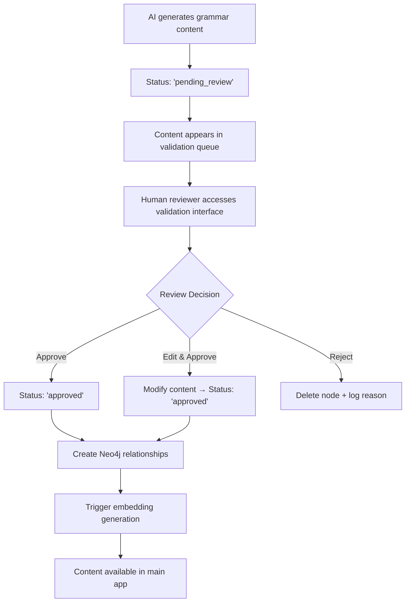

# Human Validation Interface - Architecture & Implementation

## 🎯 Overview

The Human Validation Interface is a critical component that ensures all AI-generated content meets quality standards before being presented to learners. This Streamlit-based internal tool provides linguists and content reviewers with an efficient workflow to validate, edit, and approve grammar content.

## 🏗️ Architecture Design

### Technology Stack
- **Framework**: Streamlit (Python web framework)
- **Database**: Direct Neo4j integration
- **Authentication**: Simple admin-level access control
- **Deployment**: Docker container alongside main application

### Core Components
```
validation-ui/
├── main.py                 # Streamlit app entry point
├── pages/
│   ├── dashboard.py        # Pending reviews overview
│   ├── review_detail.py    # Individual item review
│   └── analytics.py        # Validation statistics
├── components/
│   ├── grammar_display.py  # Grammar content renderer
│   ├── relationship_editor.py # Relationship management
│   └── approval_actions.py # Validation action buttons
├── services/
│   ├── neo4j_service.py   # Database operations
│   ├── validation_service.py # Business logic
│   └── embedding_trigger.py # Post-approval workflows
├── requirements.txt        # Python dependencies
└── config.py              # Configuration management
```

## 🔄 Validation Workflow

### 1. Content Generation Flow


### 2. Database Status Management
```cypher
// Pending review nodes
MATCH (g:GrammarPoint {status: 'pending_review'}) 
RETURN g

// Approval workflow
MATCH (g:GrammarPoint {id: $grammar_id})
SET g.status = 'approved'
WITH g
// Create actual relationships based on approved suggestions
UNWIND $prerequisites as prereq
MATCH (p:GrammarPoint {id: prereq.id})
CREATE (g)-[:HAS_PREREQUISITE]->(p)

// Rejection workflow  
MATCH (g:GrammarPoint {id: $grammar_id})
DETACH DELETE g
```

## 💻 Implementation Details

### 1. Main Application Entry Point

```python
# validation-ui/main.py
import streamlit as st
from pages import dashboard, review_detail, analytics
from services.neo4j_service import Neo4jService
from config import ValidationConfig

def main():
    st.set_page_config(
        page_title="AI Language Tutor - Content Validation",
        page_icon="📝",
        layout="wide"
    )
    
    # Initialize services
    if 'neo4j_service' not in st.session_state:
        config = ValidationConfig()
        st.session_state.neo4j_service = Neo4jService(config)
    
    # Navigation
    st.sidebar.title("Content Validation")
    page = st.sidebar.selectbox(
        "Navigate to:",
        ["Dashboard", "Analytics", "Settings"]
    )
    
    # Route to appropriate page
    if page == "Dashboard":
        dashboard.show_dashboard()
    elif page == "Analytics":
        analytics.show_analytics()
    
    # Display pending count in sidebar
    pending_count = st.session_state.neo4j_service.get_pending_count()
    st.sidebar.metric("Pending Reviews", pending_count)

if __name__ == "__main__":
    main()
```

### 2. Dashboard - Pending Reviews

```python
# validation-ui/pages/dashboard.py
import streamlit as st
import pandas as pd
from datetime import datetime

def show_dashboard():
    st.title("📋 Pending Grammar Reviews")
    
    neo4j_service = st.session_state.neo4j_service
    
    # Fetch pending items
    pending_items = neo4j_service.get_pending_grammar_points()
    
    if not pending_items:
        st.success("🎉 No pending reviews! All content is up to date.")
        return
    
    # Convert to DataFrame for better display
    df = pd.DataFrame([
        {
            "ID": item["id"],
            "Name": item["name"],
            "JLPT Level": item.get("jlptLevel", "Unknown"),
            "Created": item.get("created_date", "Unknown"),
            "AI Provider": item.get("generated_by", "Unknown")
        }
        for item in pending_items
    ])
    
    # Display metrics
    col1, col2, col3 = st.columns(3)
    with col1:
        st.metric("Total Pending", len(pending_items))
    with col2:
        jlpt_counts = df["JLPT Level"].value_counts()
        most_common_level = jlpt_counts.index[0] if not jlpt_counts.empty else "N/A"
        st.metric("Most Common Level", most_common_level)
    with col3:
        provider_counts = df["AI Provider"].value_counts()
        primary_provider = provider_counts.index[0] if not provider_counts.empty else "N/A"
        st.metric("Primary AI Provider", primary_provider)
    
    # Interactive table with review buttons
    st.subheader("Pending Items")
    
    for idx, row in df.iterrows():
        col1, col2, col3, col4, col5 = st.columns([2, 1, 1, 1, 1])
        
        with col1:
            st.write(f"**{row['Name']}** ({row['JLPT Level']})")
        with col2:
            st.write(row['AI Provider'])
        with col3:
            st.write(row['Created'])
        with col4:
            if st.button("Review", key=f"review_{row['ID']}"):
                st.session_state.current_review_id = row['ID']
                st.rerun()
        with col5:
            if st.button("Quick Approve", key=f"approve_{row['ID']}"):
                quick_approve_item(row['ID'])
                st.rerun()
    
    # Show detailed review if item selected
    if hasattr(st.session_state, 'current_review_id'):
        show_detailed_review(st.session_state.current_review_id)

def quick_approve_item(item_id: str):
    """Quick approval without detailed review"""
    neo4j_service = st.session_state.neo4j_service
    success = neo4j_service.approve_grammar_point(item_id)
    
    if success:
        st.success(f"✅ Item {item_id} approved and relationships created!")
        # Trigger embedding generation
        trigger_embedding_generation(item_id)
    else:
        st.error(f"❌ Failed to approve item {item_id}")

def show_detailed_review(item_id: str):
    """Show detailed review interface"""
    st.markdown("---")
    st.subheader(f"🔍 Detailed Review: {item_id}")
    
    neo4j_service = st.session_state.neo4j_service
    item = neo4j_service.get_grammar_point_details(item_id)
    
    if not item:
        st.error("Item not found!")
        return
    
    # Display AI-generated content
    col1, col2 = st.columns(2)
    
    with col1:
        st.markdown("### 📝 Content")
        st.write(f"**Name**: {item['name']}")
        st.write(f"**Description**: {item['description']}")
        st.write(f"**Structure**: {item.get('structure', 'N/A')}")
        st.write(f"**JLPT Level**: {item.get('jlptLevel', 'N/A')}")
        
        # Show example sentences
        if 'examples' in item:
            st.markdown("**Examples:**")
            for example in item['examples']:
                st.write(f"- {example}")
    
    with col2:
        st.markdown("### 🔗 Proposed Relationships")
        
        # Prerequisites
        if 'suggested_prerequisites' in item:
            st.write("**Prerequisites:**")
            for prereq in item['suggested_prerequisites']:
                st.write(f"- {prereq}")
        
        # Contrasts
        if 'suggested_contrasts' in item:
            st.write("**Contrasts With:**")
            for contrast in item['suggested_contrasts']:
                st.write(f"- {contrast}")
    
    # Validation actions
    st.markdown("### ✅ Validation Actions")
    
    col1, col2, col3 = st.columns(3)
    
    with col1:
        if st.button("✅ Approve", key=f"detailed_approve_{item_id}"):
            approve_with_relationships(item_id, item)
            st.success("Content approved!")
            del st.session_state.current_review_id
            st.rerun()
    
    with col2:
        if st.button("✏️ Edit & Approve", key=f"edit_approve_{item_id}"):
            show_edit_interface(item_id, item)
    
    with col3:
        if st.button("❌ Reject", key=f"reject_{item_id}"):
            show_rejection_interface(item_id)

def approve_with_relationships(item_id: str, item: dict):
    """Approve item and create all relationships"""
    neo4j_service = st.session_state.neo4j_service
    
    # Update status to approved
    neo4j_service.approve_grammar_point(item_id)
    
    # Create prerequisite relationships
    if 'suggested_prerequisites' in item:
        for prereq in item['suggested_prerequisites']:
            neo4j_service.create_prerequisite_relationship(item_id, prereq)
    
    # Create contrast relationships
    if 'suggested_contrasts' in item:
        for contrast in item['suggested_contrasts']:
            neo4j_service.create_contrast_relationship(item_id, contrast)
    
    # Trigger embedding generation
    trigger_embedding_generation(item_id)

def trigger_embedding_generation(item_id: str):
    """Trigger embedding generation for approved content"""
    # This could be a background task or API call
    # For now, just log the action
    st.info(f"🔄 Embedding generation triggered for {item_id}")
```

### 3. Neo4j Service Layer

```python
# validation-ui/services/neo4j_service.py
from neo4j import GraphDatabase
from typing import List, Dict, Optional
import logging

class Neo4jService:
    def __init__(self, config):
        self.driver = GraphDatabase.driver(
            config.neo4j_uri,
            auth=(config.neo4j_username, config.neo4j_password)
        )
    
    def get_pending_grammar_points(self) -> List[Dict]:
        """Fetch all grammar points with pending_review status"""
        with self.driver.session() as session:
            result = session.run("""
                MATCH (g:GrammarPoint {status: 'pending_review'})
                RETURN g.id as id, g.name as name, g.description as description,
                       g.jlptLevel as jlptLevel, g.created_date as created_date,
                       g.generated_by as generated_by
                ORDER BY g.created_date DESC
            """)
            return [record.data() for record in result]
    
    def get_grammar_point_details(self, item_id: str) -> Optional[Dict]:
        """Get detailed information for a specific grammar point"""
        with self.driver.session() as session:
            result = session.run("""
                MATCH (g:GrammarPoint {id: $item_id})
                RETURN g.id as id, g.name as name, g.description as description,
                       g.structure as structure, g.jlptLevel as jlptLevel,
                       g.suggested_prerequisites as suggested_prerequisites,
                       g.suggested_contrasts as suggested_contrasts,
                       g.examples as examples
            """, item_id=item_id)
            
            record = result.single()
            return record.data() if record else None
    
    def approve_grammar_point(self, item_id: str) -> bool:
        """Update grammar point status to approved"""
        try:
            with self.driver.session() as session:
                result = session.run("""
                    MATCH (g:GrammarPoint {id: $item_id})
                    SET g.status = 'approved', g.approved_date = datetime()
                    RETURN g.id as id
                """, item_id=item_id)
                
                return result.single() is not None
        except Exception as e:
            logging.error(f"Failed to approve grammar point {item_id}: {e}")
            return False
    
    def create_prerequisite_relationship(self, item_id: str, prereq_id: str) -> bool:
        """Create prerequisite relationship between grammar points"""
        try:
            with self.driver.session() as session:
                result = session.run("""
                    MATCH (g:GrammarPoint {id: $item_id})
                    MATCH (p:GrammarPoint {id: $prereq_id})
                    MERGE (g)-[:HAS_PREREQUISITE]->(p)
                    RETURN g.id as id
                """, item_id=item_id, prereq_id=prereq_id)
                
                return result.single() is not None
        except Exception as e:
            logging.error(f"Failed to create prerequisite relationship: {e}")
            return False
    
    def create_contrast_relationship(self, item_id: str, contrast_id: str) -> bool:
        """Create contrast relationship between grammar points"""
        try:
            with self.driver.session() as session:
                result = session.run("""
                    MATCH (g:GrammarPoint {id: $item_id})
                    MATCH (c:GrammarPoint {id: $contrast_id})
                    MERGE (g)-[:CONTRASTS_WITH]->(c)
                    RETURN g.id as id
                """, item_id=item_id, contrast_id=contrast_id)
                
                return result.single() is not None
        except Exception as e:
            logging.error(f"Failed to create contrast relationship: {e}")
            return False
    
    def reject_grammar_point(self, item_id: str, reason: str) -> bool:
        """Delete rejected grammar point and log reason"""
        try:
            with self.driver.session() as session:
                # Log rejection reason first
                session.run("""
                    CREATE (r:RejectionLog {
                        item_id: $item_id,
                        reason: $reason,
                        rejected_date: datetime()
                    })
                """, item_id=item_id, reason=reason)
                
                # Delete the grammar point
                result = session.run("""
                    MATCH (g:GrammarPoint {id: $item_id})
                    DETACH DELETE g
                    RETURN count(g) as deleted_count
                """, item_id=item_id)
                
                return result.single()["deleted_count"] > 0
        except Exception as e:
            logging.error(f"Failed to reject grammar point {item_id}: {e}")
            return False
    
    def get_pending_count(self) -> int:
        """Get count of pending review items"""
        with self.driver.session() as session:
            result = session.run("""
                MATCH (g:GrammarPoint {status: 'pending_review'})
                RETURN count(g) as count
            """)
            return result.single()["count"]
    
    def close(self):
        """Close database connection"""
        self.driver.close()
```

### 4. Configuration

```python
# validation-ui/config.py
from pydantic import BaseSettings
from typing import Optional

class ValidationConfig(BaseSettings):
    # Neo4j Configuration
    neo4j_uri: str
    neo4j_username: str
    neo4j_password: str
    
    # Application Settings
    app_title: str = "AI Language Tutor - Content Validation"
    debug: bool = False
    
    # Authentication (simple for internal tool)
    admin_password: Optional[str] = None
    
    class Config:
        env_file = ".env"
        case_sensitive = False
```

### 5. Requirements

```txt
# validation-ui/requirements.txt
streamlit>=1.28.0
neo4j>=5.14.0
pandas>=2.0.0
pydantic>=2.0.0
python-dotenv>=1.0.0
```

## 🚀 Deployment

### Docker Integration
```dockerfile
# validation-ui/Dockerfile
FROM python:3.11-slim

WORKDIR /app

COPY requirements.txt .
RUN pip install -r requirements.txt

COPY . .

EXPOSE 8501

CMD ["streamlit", "run", "main.py", "--server.port=8501", "--server.address=0.0.0.0"]
```

### Docker Compose Integration
```yaml
# Add to main docker-compose.yml
validation-ui:
  build:
    context: ./validation-ui
    dockerfile: Dockerfile
  ports:
    - "8501:8501"
  volumes:
    - ./validation-ui:/app
  env_file:
    - ./.env
  depends_on:
    - backend
```

## 📊 Analytics & Monitoring

### Validation Metrics
- **Review throughput**: Items reviewed per day/week
- **Approval rates**: Percentage of approved vs rejected content  
- **AI provider quality**: Approval rates by AI provider/model
- **Review time**: Average time spent per review
- **Relationship accuracy**: Quality of AI-suggested relationships

### Quality Feedback Loop
- **Rejection analysis**: Common reasons for content rejection
- **AI model improvement**: Feed rejection data back to improve prompts
- **Reviewer consistency**: Track inter-reviewer agreement
- **Content quality trends**: Monitor improvement over time

## 🔐 Security Considerations

### Access Control
- Simple password-based authentication for internal use
- IP-based restrictions for additional security
- Session management for reviewer accountability

### Data Protection
- All validation actions are logged with timestamps
- Audit trail for approved/rejected content
- Backup of critical validation decisions

This validation interface ensures that only high-quality, human-verified content reaches learners while providing an efficient workflow for content reviewers and maintaining detailed audit trails for continuous improvement.