# CanDo Lesson Creation End-to-End Flow

## Overview

This document describes the complete end-to-end flow of CanDo lesson creation, from user profile building through learning path generation, pre-lesson kit creation, lesson compilation, database persistence, and display.

The flow consists of two main phases:
1. **Profile & Path Building**: User builds profile → Learning path generated → Pre-lesson kits created
2. **Lesson Compilation**: User selects CanDo → Lesson compiled → Lesson displayed

## Architecture Overview

The CanDo lesson creation system follows a streaming architecture to handle long-running compilation processes without timeout issues. The flow involves:

- **Frontend**: React/Next.js application
- **Backend API**: FastAPI with Server-Sent Events (SSE) streaming
- **Compilation Pipeline**: Multi-step LLM-based card generation
- **Databases**: 
  - PostgreSQL: Stores compiled lessons and versions
  - Neo4j: Stores CanDo metadata and entity relationships
- **External Services**:
  - OpenAI: LLM for card generation
  - Gemini: Optional image generation

## Complete Flow Diagram

```mermaid
flowchart TD
    Start([User Starts App]) --> CheckProfile{Profile Exists?}
    CheckProfile -->|No| ProfileFlow[Profile Building Flow]
    CheckProfile -->|Yes| LearningPathFlow[Learning Path Flow]
    
    ProfileFlow --> ProfileChat[Chatbot Conversation]
    ProfileChat --> ExtractProfile[Extract Profile Data via AI]
    ExtractProfile --> SaveProfile[Save Profile to Database]
    SaveProfile --> GeneratePath[Generate Learning Path]
    
    GeneratePath --> SelectCanDos[Select CanDo Descriptors from Neo4j]
    SelectCanDos --> BuildPath[Build Semantically Ordered Path]
    BuildPath --> SavePath[Save Learning Path to Database]
    SavePath --> ListCanDos[List CanDo Lessons in Path]
    
    ListCanDos --> GenPreLessonKit[Generate Pre-Lesson Kit for Each CanDo]
    GenPreLessonKit --> FetchCanDoMeta[Fetch CanDo Metadata]
    FetchCanDoMeta --> GenContext[Generate CanDo Context]
    GenContext --> GenWords[Generate Necessary Words]
    GenWords --> GenGrammar[Generate Necessary Grammar]
    GenGrammar --> GenPhrases[Generate Fixed Phrases]
    GenPhrases --> SaveKit[Save Pre-Lesson Kit to Learning Path]
    
    SaveKit --> LessonCompilation[Lesson Compilation Flow]
    LearningPathFlow --> LessonCompilation
    
    LessonCompilation --> UserClicks([User Clicks Compile/Regenerate]) 
    UserClicks --> Frontend[Frontend: page.tsx]
    Frontend --> CheckDB{Check Existing Lesson}
    CheckDB -->|Found| LoadLesson[Load from Database]
    CheckDB -->|Not Found| Compile[Start Compilation]
    LoadLesson --> Display[Display Lesson]
    
    Compile --> APICall[API: compileLessonV2Stream]
    APICall --> SSE[SSE Stream Connection]
    SSE --> BackendAPI[Backend: /compile_v2_stream]
    
    BackendAPI --> SendStatus[Send Status Event]
    SendStatus --> StartTask[Create Async Task]
    StartTask --> CompileFunc[compile_lessonroot]
    
    CompileFunc --> LoadModule[Load Pipeline Module]
    LoadModule --> FetchMeta[Fetch CanDo Metadata from Neo4j]
    FetchMeta --> InitLLM[Initialize OpenAI Client]
    
    InitLLM --> CheckKit{Pre-Lesson Kit Available?}
    CheckKit -->|user_id provided| FetchKit[Fetch Kit from Learning Path]
    CheckKit -->|kit provided| UseKit[Use Provided Kit]
    CheckKit -->|no kit| SkipKit[Skip Kit Integration]
    FetchKit --> BuildKitContext[Build Kit Context & Requirements]
    UseKit --> BuildKitContext
    BuildKitContext --> GenPlan[Generate Domain Plan]
    SkipKit --> GenPlan
    GenPlan --> GenObjective[Generate Objective Card]
    GenObjective --> GenDialogue[Generate Dialogue Card]
    GenDialogue --> GenReading[Generate Reading Card]
    
    GenReading --> ExtractText[Extract Text from Dialogue & Reading]
    ExtractText --> ExtractEntities[Extract Words & Grammar Entities]
    ExtractEntities --> ResolveEntities{Resolve Entities in Neo4j}
    
    ResolveEntities -->|Success| GenWordsFromEntities[Generate Words Card from Entities]
    ResolveEntities -->|Fallback| GenWordsFromPlan[Generate Words Card from Plan]
    ResolveEntities -->|Success| GenGrammarFromEntities[Generate Grammar Card from Entities]
    ResolveEntities -->|Fallback| GenGrammarFromPlan[Generate Grammar Card from Plan]
    
    GenWordsFromEntities --> GenRemaining
    GenWordsFromPlan --> GenRemaining
    GenGrammarFromEntities --> GenRemaining
    GenGrammarFromPlan --> GenRemaining
    
    GenRemaining[Generate Remaining Cards] --> GenGuided[Generate Guided Dialogue]
    GenGuided --> GenExercises[Generate Exercises]
    GenExercises --> GenCulture[Generate Culture Card]
    GenCulture --> GenDrills[Generate Drills Card]
    
    GenDrills --> Assemble[Assemble Lesson Root]
    Assemble --> EnrichGrammar[Enrich Grammar with Neo4j IDs]
    EnrichGrammar --> LinkEntities[Link Dialogue Entities in Neo4j]
    
    LinkEntities --> TrackKitUsage{Kit Used?}
    TrackKitUsage -->|Yes| AnalyzeUsage[Track Kit Usage in Lesson]
    TrackKitUsage -->|No| CheckImages
    AnalyzeUsage --> CheckImages{GEMINI_API_KEY Set?}
    CheckImages -->|Yes| GenImages[Generate Images]
    CheckImages -->|No| SkipImages[Skip Image Generation]
    
    GenImages --> PersistDB
    SkipImages --> PersistDB[Persist to PostgreSQL]
    
    PersistDB --> UpsertLesson{Upsert Lesson Record}
    UpsertLesson -->|New| CreateLesson[Create Lesson Record]
    UpsertLesson -->|Exists| GetLessonId[Get Existing Lesson ID]
    CreateLesson --> GetVersion
    GetLessonId --> GetVersion[Get Next Version Number]
    GetVersion --> InsertVersion[Insert Lesson Version]
    InsertVersion --> CommitDB[Commit Transaction]
    
    CommitDB --> ReturnResult[Return Result]
    ReturnResult --> SendResult[Send Result Event via SSE]
    SendResult --> FrontendReceive[Frontend Receives Result]
    
    FrontendReceive --> FetchLesson[Fetch Lesson from Database]
    FetchLesson --> ParseData[Parse Lesson Data]
    ParseData --> Display
    
    CompileFunc -.->|Error| ErrorHandler[Error Handler]
    ErrorHandler --> SendError[Send Error Event via SSE]
    SendError --> FrontendError[Frontend Displays Error]
    
    BackendAPI -.->|Keepalive| Keepalive[Send Keepalive Every 10s]
    Keepalive -.->|While Compiling| BackendAPI
```



## Detailed Step-by-Step Process

### Phase 0: Profile Building and Learning Path Generation

**Files**: 
- `backend/app/services/profile_building_service.py`
- `backend/app/services/learning_path_service.py`
- `backend/app/services/user_path_service.py`
- `backend/app/services/prelesson_kit_service.py`
- `backend/app/api/v1/endpoints/profile.py`

This phase occurs **before** lesson compilation and creates a personalized learning path for the user.

#### Step 0.1: Profile Building Conversation
1. User starts profile building (if profile doesn't exist)
2. Frontend initiates chatbot conversation via `/api/v1/profile/chat` or similar
3. AI chatbot asks questions about:
   - Learning goals
   - Previous knowledge and experience
   - Learning experiences and preferences
   - Usage context (where/when they want to use the language)
4. Conversation messages are stored in `conversation_sessions` and `conversation_messages` tables

#### Step 0.2: Profile Data Extraction
1. When user completes conversation, frontend calls `/api/v1/profile/extract`
2. Backend calls `profile_building_service.extract_profile_data(conversation_messages)`
3. AI analyzes conversation and extracts structured data:
   - `learning_goals`: List of goals
   - `previous_knowledge`: Experience level, years studying, formal classes, etc.
   - `learning_experiences`: Preferred methods, learning style, study schedule, etc.
   - `usage_context`: Contexts, urgency, specific situations, target date
   - `current_level`: Assessed level (beginner_1, beginner_2, intermediate_1, etc.)
4. Data is validated using Pydantic `ProfileData` schema

#### Step 0.3: Profile Saving
1. Backend calls `profile_building_service.save_profile_data()`
2. Profile is saved to `user_profiles` table (JSONB fields)
3. User's `current_level` is updated in `users` table
4. Profile completion status is marked

#### Step 0.4: Learning Path Generation
1. After profile completion, learning path is automatically generated
2. Backend calls `learning_path_service.generate_learning_path()`
3. Service uses `user_path_service.generate_user_path()` which:
   - Analyzes profile to extract requirements
   - Maps user level to CEFR (beginner_1 → A1, etc.)
   - Calls `cando_selector_service` to select relevant CanDo descriptors from Neo4j
   - Uses `path_builder` to build semantically ordered path
   - Uses `cando_complexity_service` to order by complexity
4. Learning path contains:
   - List of `LearningPathStep` objects, each with:
     - `step_id`: Unique identifier
     - `can_do_id`: CanDo descriptor ID
     - `can_do_meta`: CanDo metadata (title, level, description)
     - `order`: Position in path
     - `milestone_id`: Associated milestone (optional)
     - `prelesson_kit`: Pre-lesson kit (generated in next step)
5. Path is saved to `learning_paths` table with:
   - `path_data`: JSONB containing steps array
   - `progress_data`: JSONB tracking user progress
   - `version`: Path version number

#### Step 0.5: Pre-Lesson Kit Generation
1. For each CanDo in the learning path, a pre-lesson kit can be generated
2. This happens either:
   - Automatically when learning path is created (if `include_prelesson_kit=true`)
   - On-demand via `/api/v1/profile/learning-path/prelesson-kit`
   - When creating a new CanDo via `/api/v1/cando/create` (if `include_prelesson_kit=true`)
3. Backend calls `prelesson_kit_service.generate_kit(can_do_id, learner_level, neo4j_session)`
4. Kit generation process:
   - **Fetch CanDo Metadata**: Queries Neo4j for CanDo descriptor
   - **Generate CanDo Context**: 
     - Tries to get pragmatics from Neo4j graph first (via `pragmatics_service`)
     - If missing, generates via AI:
       - `situation`: Brief scenario description (1-2 sentences)
       - `pragmatic_act`: Communication act (e.g., "request (polite)", "offer (casual)")
       - `notes`: Optional cultural/usage notes
   - **Generate Necessary Words**: 8-12 essential vocabulary words for the situation
     - Each word has: surface (Japanese), reading, pos (part of speech), translation
   - **Generate Grammar Patterns**: 3-5 essential grammar patterns
     - Each pattern has: pattern name, explanation, examples (JapaneseText objects)
   - **Generate Fixed Phrases**: 4-6 essential conversational phrases
     - Each phrase has: phrase (JapaneseText), usage_note, register (formality level)
5. Pre-lesson kit is stored in learning path step's `prelesson_kit` field
6. Kit structure:
   ```json
   {
     "can_do_context": {
       "situation": "...",
       "pragmatic_act": "...",
       "notes": "..."
     },
     "necessary_words": [
       {"surface": "レストラン", "reading": "れすとらん", "pos": "noun", "translation": "restaurant"}
     ],
     "necessary_grammar_patterns": [
       {"pattern": "〜たいです", "explanation": "...", "examples": [...]}
     ],
     "necessary_fixed_phrases": [
       {"phrase": {...}, "usage_note": "...", "register": "polite"}
     ]
   }
   ```
7. **Usage in Lesson Sessions**: The pre-lesson kit is used when starting a lesson session:
   - Kit context is included in guided dialogue prompts
   - Ensures lesson content aligns with pre-lesson preparation
   - Words and grammar from kit are emphasized in lesson generation

#### Step 0.6: Learning Path Display
1. Frontend fetches learning path via `/api/v1/profile/learning-path`
2. Displays list of CanDo lessons in the path
3. Each step shows:
   - CanDo title and description
   - CanDo level and skill domain
   - Pre-lesson kit (if generated) - shows words, grammar, phrases
   - Progress status
   - Order in path
4. User can:
   - View pre-lesson kit for preparation
   - Click on a CanDo to start lesson compilation
   - See which lessons are completed/in-progress/not-started

### Phase 1: Frontend Initiation

**File**: `frontend/src/app/cando/[canDoId]/page.tsx`

1. User navigates to CanDo detail page or clicks "Regenerate" button
2. Frontend calls `loadLessonV2()` function
3. First attempts to fetch existing lesson from database:
   - Calls `/api/v1/cando/lessons/list?can_do_id={canDoId}`
   - If found, fetches latest version via `/api/v1/cando/lessons/fetch/{lesson_id}`
   - Parses and displays lesson
4. If no lesson found, initiates compilation

### Phase 2: Lesson Compilation Initiation

**File**: `frontend/src/app/cando/[canDoId]/page.tsx`

1. User navigates to CanDo detail page (either from learning path or directly)
2. Frontend calls `loadLessonV2()` function
3. First attempts to fetch existing lesson from database:
   - Calls `/api/v1/cando/lessons/list?can_do_id={canDoId}`
   - If found, fetches latest version via `/api/v1/cando/lessons/fetch/{lesson_id}`
   - Parses and displays lesson
4. If no lesson found, initiates compilation

### Phase 3: API Streaming Endpoint

**File**: `frontend/src/lib/api.ts` (lines 78-162)
**File**: `backend/app/api/v1/endpoints/cando.py` (lines 1104-1151)

1. Frontend calls `compileLessonV2Stream(canDoId, metalanguage, model, onStatus)`
2. Creates SSE connection to `/api/v1/cando/lessons/compile_v2_stream`
3. Backend endpoint:
   - Immediately sends `status` event with `{"status": "started", ...}`
   - Creates async task for `compile_lessonroot()`
   - Sends keepalive messages every 10 seconds while compiling
   - On completion, sends `result` event with compiled lesson
   - On error, sends `error` event with error details

### Phase 4: Compilation Pipeline

**File**: `backend/app/services/cando_v2_compile_service.py`

#### Step 1: Load Pipeline Module
- Dynamically loads `backend/scripts/canDo_creation_new.py`
- This module contains all card generation functions

#### Step 2: Fetch CanDo Metadata
- Queries Neo4j for CanDo descriptor:
  ```cypher
  MATCH (c:CanDoDescriptor {uid: $id})
  RETURN c.uid, c.level, c.primaryTopic, ...
  ```
- Extracts: uid, level, primaryTopic, skillDomain, type, descriptions, titles, source

#### Step 3: Initialize LLM Client
- Creates OpenAI client with specified model (default: gpt-4o)
- Configures timeout (default: 120 seconds)
- Returns synchronous LLM call function

#### Step 3.5: Fetch and Build Pre-Lesson Kit Context (if applicable)
- **If `user_id` provided and `prelesson_kit` is None**:
  - Calls `_fetch_prelesson_kit_from_path(pg, can_do_id, user_id)`
  - Searches user's active learning path for kit associated with this CanDo
  - Falls back to any active path if user-specific path not found
- **If `prelesson_kit` provided directly**: Uses provided kit
- **Build Kit Context**:
  - Calls `_build_prelesson_kit_context(prelesson_kit)`
  - Extracts CanDo context (situation, pragmatic act, notes)
  - Lists essential words, grammar patterns, and fixed phrases
  - Calculates mandatory requirements:
    - Words: max(6, 30% of kit words)
    - Grammar: max(2, 20% of kit patterns)
    - Phrases: max(2, 20% of kit phrases)
  - Returns formatted context strings for LLM prompts

#### Step 4: Generate Domain Plan
- Calls `pipeline.gen_domain_plan(llm_call, cando_input, metalanguage)`
- Creates structured plan with scenarios, roles, vocabulary, grammar patterns
- This plan guides all subsequent card generation

#### Step 5: Generate Objective Card
- Calls `pipeline.gen_objective_card(llm_call, metalanguage, cando_meta, plan)`
- Creates objective card with learning goals

#### Step 6: Generate Dialogue Card
- Calls `pipeline.gen_dialogue_card(llm_call, metalanguage, plan, kit_context=kit_context, kit_requirements=kit_requirements)`
- Creates dialogue with setting, characters, and turns
- **Kit Integration**: Kit context is included in prompt, ensuring:
  - Kit words appear naturally in dialogue
  - Kit grammar patterns are used
  - Kit phrases are incorporated contextually
- **Important**: Generated BEFORE words/grammar to provide context

#### Step 7: Generate Reading Card
- Calls `pipeline.gen_reading_card(llm_call, metalanguage, cando_input, plan, dialog, kit_context=kit_context, kit_requirements=kit_requirements)`
- Uses dialogue as context to create reading comprehension
- **Kit Integration**: Kit context ensures kit elements appear in extended narrative
- **Important**: Generated AFTER dialogue to extend domain

#### Step 8: Extract Entities
- Extracts Japanese text from dialogue and reading cards
- Combines text: `reading_text + dialogue_text`
- Calls `session_service._extract_entities_from_text(text_blob, provider="openai")`
- Extracts words and grammar patterns using NLP

#### Step 9: Resolve Entities
- Resolves extracted words to Neo4j: `_resolve_words(neo, words)`
- Resolves grammar patterns: `_resolve_grammar(neo, grammarPatterns)`
- **Fallback**: If insufficient entities (< 8 words or < 4 grammar patterns):
  - Uses `_deterministic_words(neo, text)` 
  - Uses `_deterministic_grammar(neo, text)`

#### Step 10-11: Generate Words & Grammar Cards
- **If entities resolved**: 
  - `gen_words_card_from_extracted(llm_call, metalanguage, plan, dialog, reading, resolved_words, kit_context=kit_context, kit_requirements=kit_requirements)`
  - `gen_grammar_card_from_extracted(llm_call, metalanguage, plan, dialog, reading, resolved_grammar, kit_context=kit_context, kit_requirements=kit_requirements)`
  - **Kit Integration**: Kit context prioritizes kit words and grammar patterns
- **If no entities** (fallback):
  - `gen_words_card(llm_call, metalanguage, plan)`
  - `gen_grammar_card(llm_call, metalanguage, plan)`
  - Note: Fallback doesn't use kit context (entities-based generation preferred)

#### Step 12-15: Generate Remaining Cards
- `gen_guided_dialogue_card(llm_call, metalanguage, plan)`
- `gen_exercises_card(llm_call, metalanguage, plan)`
- `gen_culture_card(llm_call, metalanguage, plan)`
- `gen_drills_card(llm_call, metalanguage, plan)`

#### Step 16: Assemble Lesson Root
- Calls `pipeline.assemble_lesson(metalanguage, cando_input, plan, obj, words, grammar, dialog, reading, guided, exercises, culture, drills, lesson_id)`
- Combines all cards into `LessonRoot` Pydantic model
- Converts to JSON: `root.model_dump_json()`

#### Step 17: Enrich Grammar IDs
- Calls `_enrich_grammar_neo4j_ids(neo, lesson_json)`
- Queries Neo4j for grammar pattern IDs
- Adds `neo4j_id` field to grammar patterns in lesson JSON

#### Step 18: Link Dialogue Entities
- Calls `_link_dialogue_entities(neo, can_do_id, resolved_words, resolved_grammar)`
- Creates relationships in Neo4j:
  - `(CanDoDescriptor)-[:USES_WORD]->(Word)`
  - `(CanDoDescriptor)-[:USES_GRAMMAR]->(GrammarPattern)`
- Only executed if entities were successfully extracted

#### Step 19: Generate Images (Optional)
- Checks if `GEMINI_API_KEY` environment variable is set
- If set, calls `ensure_image_paths_for_lesson(lesson_json, can_do_id)`
- Generates images for dialogue, reading, and other cards
- Updates lesson JSON with image paths
- Returns count of images generated

#### Step 20: Track Kit Usage
- **If pre-lesson kit was used**:
  - Calls `_track_kit_usage(lesson_json, prelesson_kit)`
  - Extracts all Japanese text from compiled lesson
  - Counts which kit words, grammar patterns, and phrases appear
  - Verifies mandatory requirements are met
  - Calculates overall usage percentage
  - Logs usage statistics
  - Warns if requirements not met

#### Step 21: Persist to Database
- **Upsert Lesson**:
  - Checks if lesson exists: `SELECT id FROM lessons WHERE can_do_id = :cid`
  - If exists, uses existing `lesson_id`
  - If not, inserts: `INSERT INTO lessons (can_do_id, status) VALUES (:cid, 'draft') RETURNING id`
- **Insert Version**:
  - Gets next version: `SELECT COALESCE(MAX(version),0) FROM lesson_versions WHERE lesson_id=:lid`
  - Increments version number
  - Inserts: `INSERT INTO lesson_versions (lesson_id, version, lesson_plan) VALUES (:lid, :ver, :plan)`
  - `lesson_plan` is stored as JSONB containing full lesson structure
- **Commit Transaction**: `await pg.commit()`

#### Step 22: Return Result
- Returns dictionary:
  ```python
  {
    "lesson_id": lesson_id,
    "version": next_ver,
    "lesson": lesson_json,
    "prelesson_kit_usage": {  # Optional, only if kit was used
      "words": {
        "used": [...],
        "count": int,
        "total": int,
        "required": int,
        "meets_requirement": bool
      },
      "grammar": {...},
      "phrases": {...},
      "all_requirements_met": bool,
      "usage_percentage": float
    }
  }
  ```
- Backend sends this as `result` event via SSE
- Frontend receives and processes

### Phase 5: Frontend Processing

**File**: `frontend/src/app/cando/[canDoId]/page.tsx`

1. Receives `result` event from SSE stream
2. Fetches compiled lesson from database:
   - Calls `/api/v1/cando/lessons/list?can_do_id={canDoId}`
   - Gets latest lesson version
   - Calls `/api/v1/cando/lessons/fetch/{lesson_id}`
3. Parses lesson data using `parseAndSetLessonData()`
4. Validates lesson structure
5. Sets state: `setLessonRootData(lessonData)`
6. Renders lesson using `LessonRootRenderer` component

## Dependencies

### Required Services

1. **Neo4j Database**
   - Stores CanDo descriptors
   - Stores word and grammar pattern entities
   - Stores pragmatic patterns
   - Required for: 
     - Profile building: CanDo selection for learning paths
     - Metadata fetching
     - Entity resolution
     - Relationship linking
     - Pre-lesson kit context generation

2. **PostgreSQL Database**
   - Stores user profiles in `user_profiles` table
   - Stores learning paths in `learning_paths` table
   - Stores compiled lessons in `lessons` table
   - Stores lesson versions in `lesson_versions` table
   - Stores conversation sessions in `conversation_sessions` and `conversation_messages` tables
   - Required for: 
     - Profile persistence
     - Learning path persistence
     - Lesson persistence and retrieval

3. **OpenAI API**
   - Required for: 
     - Profile data extraction from conversations
     - Learning path generation
     - Pre-lesson kit generation
     - All LLM-based card generation during compilation
   - Environment variable: `OPENAI_API_KEY`
   - Models used: 
     - gpt-4o-mini: Profile extraction, pre-lesson kits
     - gpt-4o: Learning path generation, lesson compilation (default)

### Optional Services

4. **Gemini API**
   - Optional for: image generation during lesson compilation
   - Environment variable: `GEMINI_API_KEY`
   - If not set, image generation is skipped

## Error Handling and Fallbacks

### Compilation Errors

1. **CanDo Not Found**
   - Error: `ValueError("cando_not_found")`
   - Handled: Backend sends `error` event via SSE
   - Frontend: Displays error message

2. **LLM API Errors**
   - OpenAI API failures
   - Handled: Exception caught, sent as `error` event
   - Frontend: Displays error message

3. **Database Errors**
   - Connection failures
   - Transaction rollback on error
   - Error sent via SSE stream

4. **Neo4j Errors**
   - Connection failures during entity resolution
   - Fallback: Uses deterministic extraction methods
   - If still fails, uses plan-based generation

### Entity Extraction Fallbacks

1. **Insufficient Entities Extracted**
   - If < 8 words: Falls back to `_deterministic_words()`
   - If < 4 grammar patterns: Falls back to `_deterministic_grammar()`

2. **No Entities Extracted**
   - Falls back to plan-based generation:
     - `gen_words_card(llm_call, metalanguage, plan)`
     - `gen_grammar_card(llm_call, metalanguage, plan)`

3. **Empty Text**
   - If dialogue/reading text is empty or too short (< 10 chars)
   - Skips entity extraction entirely
   - Uses plan-based generation

### Image Generation Errors

- If `GEMINI_API_KEY` not set: Silently skipped
- If image generation fails: Logged as warning, compilation continues
- Images are optional and don't block lesson creation

## Data Flow

### Profile Building Flow

**Input Data**:
- Conversation messages (user and AI responses)
- User information (name, native language)

**Intermediate Data**:
- Extracted profile data (learning goals, previous knowledge, learning experiences, usage context)
- Assessed current level (beginner_1 through advanced_2)

**Output Data**:
- `UserProfile` record in `user_profiles` table
- Updated `User.current_level` field

### Learning Path Generation Flow

**Input Data**:
- User profile data
- User's current level
- Learning goals and preferences

**Intermediate Data**:
- Selected CanDo descriptors from Neo4j (filtered by level, topic, etc.)
- Semantically ordered path
- Complexity-ordered steps

**Output Data**:
- `LearningPath` record in `learning_paths` table
- `path_data` JSONB containing:
  - `steps`: Array of `LearningPathStep` objects
  - Each step contains `can_do_id`, `can_do_meta`, `order`, `milestone_id`

### Pre-Lesson Kit Generation Flow

**Input Data**:
- CanDo ID
- Learner level (from user profile)
- CanDo metadata from Neo4j

**Intermediate Data**:
- CanDo context (situation, pragmatic act)
- Generated vocabulary words
- Generated grammar patterns
- Generated fixed phrases

**Output Data**:
- `PreLessonKit` object stored in learning path step's `prelesson_kit` field

### Lesson Compilation Flow

**Input Data**:
- **CanDo ID**: String identifier (e.g., "JFまるごと:336")
- **Metalanguage**: Language for instructions (default: "en")
- **Model**: OpenAI model name (default: "gpt-4o")
- **Pre-Lesson Kit**: Optional pre-lesson kit from learning path (used as context)

**Intermediate Data**:
- **Domain Plan**: Structured plan with scenarios, roles, vocabulary
- **Cards**: 11 different card types (objective, words, grammar, dialogue, reading, guided, exercises, culture, drills)
- **Entities**: Extracted words and grammar patterns
- **Resolved Entities**: Neo4j-linked entities with IDs

**Output Data**:
- **Lesson Root**: Complete lesson structure with all cards
- **Lesson JSON**: Serialized lesson for database storage
- **Database Records**: 
  - `lessons` table: One record per CanDo
  - `lesson_versions` table: Versioned lesson plans
- **Neo4j Relationships**: Links between CanDo and entities

## Performance Considerations

1. **Streaming Architecture**: Prevents timeout issues with long-running compilations
2. **Keepalive Messages**: Sent every 10 seconds to prevent connection timeouts
3. **Async Processing**: Compilation runs in async task, doesn't block other requests
4. **Database Transactions**: Single transaction for lesson persistence
5. **Image Generation**: Runs in thread pool to avoid blocking async event loop

## Complete E2E Flow Summary

The complete end-to-end flow from user registration to lesson completion:

1. **User Registration/Login** → User account created
2. **Profile Building** → Chatbot conversation → Profile extracted → Profile saved
3. **Learning Path Generation** → CanDo descriptors selected → Path built → Path saved
4. **Pre-Lesson Kit Generation** → Kit generated for each CanDo → Kit saved to path
5. **Learning Path Display** → User sees list of CanDo lessons
6. **Lesson Compilation** → User clicks CanDo → Lesson compiled → Lesson displayed
7. **Lesson Interaction** → User practices with lesson content

## Integration Points

### Pre-Lesson Kit Integration Status

**Current State**: The pre-lesson kit is generated and stored in the learning path, but it is **NOT currently integrated into the initial lesson compilation process**.

**Where it IS used**:
- **File**: `backend/app/services/cando_lesson_session_service.py` (lines 1119-1153)
- **Context**: When creating lesson sessions for guided dialogue practice
- **Method**: `_generate_simple_content()` receives `meta_extra` parameter containing `prelesson_kit` data

**How it's used in session creation**:
1. **Kit Context Inclusion**: Pre-lesson kit data is extracted from learning path step
2. **Context Building**: Kit context is formatted and included in lesson prompts:
   - **CanDo Context**: Situation and pragmatic act guide dialogue generation
   - **Word Requirements**: Mandatory minimum usage (30% of kit words, minimum 6)
   - **Grammar Requirements**: Mandatory minimum usage (20% of kit patterns, minimum 2)
   - **Fixed Phrases**: Included as examples in dialogue and exercises
3. **Lesson Alignment**: Ensures lesson content aligns with pre-lesson preparation
4. **Progressive Learning**: Students prepare with kit → practice with lesson → reinforce learning

**Where it's NOT used**:
- **File**: `backend/app/services/cando_v2_compile_service.py`
- **Function**: `compile_lessonroot()` does NOT accept or use pre-lesson kit data
- **Impact**: Initial lesson compilation does not incorporate pre-lesson kit requirements

**Integration Status**: ✅ **FULLY INTEGRATED**

The pre-lesson kit is now fully integrated into the lesson compilation process:

1. **Automatic Fetching**: When `compile_lessonroot()` is called with a `user_id`, it automatically fetches the pre-lesson kit from the user's learning path
2. **Kit Context Building**: The kit is converted into context strings that include:
   - CanDo context (situation, pragmatic act, notes)
   - Essential words list with mandatory usage requirements
   - Grammar patterns list with mandatory usage requirements
   - Fixed phrases list with mandatory usage requirements
3. **Card Generation Integration**: Kit context is passed to and included in prompts for:
   - **Dialogue Card**: Ensures kit words, grammar, and phrases are used
   - **Reading Card**: Ensures kit elements appear in the extended narrative
   - **Words Card**: Prioritizes kit words in the vocabulary selection
   - **Grammar Card**: Prioritizes kit grammar patterns
4. **Mandatory Requirements**: The kit includes mandatory usage requirements:
   - At least 30% (minimum 6) of kit words must be used
   - At least 20% (minimum 2) of kit grammar patterns must be used
   - At least 20% (minimum 2) of kit phrases must be used

**API Usage**:
The `/api/v1/cando/lessons/compile_v2_stream` endpoint now accepts an optional `user_id` query parameter. When provided, it automatically fetches and uses the pre-lesson kit from the user's learning path.

**Kit Usage Tracking**:
After compilation, the system tracks which kit elements were actually used in the lesson:
- Counts kit words, grammar patterns, and phrases found in the compiled content
- Verifies mandatory requirements are met (30% words, 20% grammar/phrases)
- Returns usage statistics in the compilation result:
  ```json
  {
    "prelesson_kit_usage": {
      "words": {
        "used": ["レストラン", "メニュー", ...],
        "count": 8,
        "total": 12,
        "required": 6,
        "meets_requirement": true
      },
      "grammar": {...},
      "phrases": {...},
      "all_requirements_met": true,
      "usage_percentage": 65.5
    }
  }
  ```

**Error Handling**:
- Kit fetching failures are logged but don't block compilation
- Malformed kits are handled gracefully
- Warnings are logged if requirements are not met
- Compilation continues even if kit integration fails

## Testing Strategy

See companion test files:
- `backend/tests/test_cando_compile_integration.py` - Integration tests for individual components
- `backend/tests/test_cando_compile_e2e.py` - End-to-end tests for full compilation flow
- `backend/tests/utils/cando_test_helpers.py` - Test utilities and fixtures
- `backend/tests/test_prelesson_kit_service.py` - Pre-lesson kit generation tests
- `backend/tests/test_profile_building_json_parsing.py` - Profile building tests

