# Pre-Lesson Kit Integration Developer Guide

## Overview

This guide explains how pre-lesson kits are integrated into the lesson compilation process. Pre-lesson kits contain essential vocabulary, grammar patterns, and fixed phrases that should be included in compiled lessons to ensure alignment with pre-lesson preparation.

## Architecture

### Components

1. **Kit Generation** (`backend/app/services/prelesson_kit_service.py`)
   - Generates kits for CanDo descriptors
   - Stores kits in learning path steps

2. **Kit Fetching** (`backend/app/services/cando_v2_compile_service.py`)
   - `_fetch_prelesson_kit_from_path()`: Retrieves kit from learning path

3. **Kit Context Building** (`backend/app/services/cando_v2_compile_service.py`)
   - `_build_prelesson_kit_context()`: Converts kit to prompt context

4. **Kit Usage Tracking** (`backend/app/services/cando_v2_compile_service.py`)
   - `_track_kit_usage()`: Analyzes compiled lesson for kit usage

5. **Card Generation** (`backend/scripts/canDo_creation_new.py`)
   - Modified to accept and use kit context in prompts

## Data Flow

```mermaid
flowchart LR
    A[Learning Path] -->|Contains| B[Pre-Lesson Kit]
    B -->|Fetched by| C[_fetch_prelesson_kit_from_path]
    C -->|Passed to| D[compile_lessonroot]
    D -->|Builds| E[Kit Context & Requirements]
    E -->|Included in| F[Card Generation Prompts]
    F -->|Generates| G[Lesson Cards]
    G -->|Analyzed by| H[_track_kit_usage]
    H -->|Returns| I[Usage Statistics]
```



## Kit Structure

A pre-lesson kit has the following structure:

```python
{
    "can_do_context": {
        "situation": "Brief scenario description",
        "pragmatic_act": "Communication act (e.g., 'order (polite)')",
        "notes": "Optional cultural or usage notes"
    },
    "necessary_words": [
        {
            "surface": "レストラン",  # Japanese word
            "reading": "れすとらん",   # Hiragana reading
            "pos": "noun",            # Part of speech
            "translation": "restaurant"
        },
        # ... more words
    ],
    "necessary_grammar_patterns": [
        {
            "pattern": "〜をください",
            "explanation": "Please give me...",
            "examples": [
                {
                    "kanji": "コーヒーをください",
                    "romaji": "koohii o kudasai",
                    "furigana": [...],
                    "translation": "Coffee please"
                }
            ]
        },
        # ... more patterns
    ],
    "necessary_fixed_phrases": [
        {
            "phrase": {
                "kanji": "いらっしゃいませ",
                "romaji": "irasshaimase",
                "furigana": [...],
                "translation": "Welcome"
            },
            "usage_note": "Used by staff to greet customers",
            "register": "polite"
        },
        # ... more phrases
    ]
}
```

## Integration Points

### 1. Compilation Entry Point

**File**: `backend/app/services/cando_v2_compile_service.py`

**Function**: `compile_lessonroot()`

**Parameters**:
- `prelesson_kit`: Optional kit dictionary (if provided directly)
- `user_id`: Optional user ID (for automatic kit fetching)

**Flow**:
1. If `prelesson_kit` is None and `user_id` is provided:
   - Calls `_fetch_prelesson_kit_from_path(pg, can_do_id, user_id)`
2. If kit is available:
   - Calls `_build_prelesson_kit_context(prelesson_kit)`
   - Gets `kit_context` and `kit_requirements` strings
3. Passes kit context to card generation functions

### 2. Card Generation

**Files**: `backend/scripts/canDo_creation_new.py`

**Modified Functions**:
- `gen_dialogue_card()`: Accepts `kit_context` and `kit_requirements`
- `gen_reading_card()`: Accepts `kit_context` and `kit_requirements`
- `gen_words_card_from_extracted()`: Accepts `kit_context` and `kit_requirements`
- `gen_grammar_card_from_extracted()`: Accepts `kit_context` and `kit_requirements`

**Prompt Building**:
- `build_dialogue_prompt()`: Includes kit context in user prompt
- `build_reading_prompt()`: Includes kit context in user prompt
- `build_words_prompt_from_dialogue()`: Includes kit context in user prompt
- `build_grammar_prompt_from_dialogue()`: Includes kit context in user prompt

**Example**:
```python
# Kit context is appended to prompts like this:
user_prompt = f"""
TARGET_MODEL: DialogueCard
...
{kit_context}
...
{kit_requirements}
...
"""
```

### 3. Usage Tracking

**Function**: `_track_kit_usage(lesson_json, kit)`

**Process**:
1. Extracts all Japanese text from compiled lesson
2. Counts kit words found in text
3. Counts kit grammar patterns found in text
4. Counts kit phrases found in text
5. Verifies mandatory requirements:
   - Words: At least 30% (minimum 6)
   - Grammar: At least 20% (minimum 2)
   - Phrases: At least 20% (minimum 2)
6. Calculates overall usage percentage
7. Returns usage statistics

**Return Value**:
```python
{
    "words": {
        "used": ["レストラン", "メニュー", ...],
        "count": 8,
        "total": 12,
        "required": 6,
        "meets_requirement": True
    },
    "grammar": {...},
    "phrases": {...},
    "all_requirements_met": True,
    "usage_percentage": 65.5
}
```

## Mandatory Requirements

The system enforces minimum usage requirements to ensure kit elements are actually used:

### Words
- **Requirement**: At least 30% of kit words, minimum 6 words
- **Calculation**: `max(6, int(len(kit_words) * 0.3))`
- **Example**: 20 kit words → requires 6 words (max(6, 6) = 6)

### Grammar Patterns
- **Requirement**: At least 20% of kit patterns, minimum 2 patterns
- **Calculation**: `max(2, int(len(kit_grammar) * 0.2))`
- **Example**: 10 patterns → requires 2 patterns (max(2, 2) = 2)

### Fixed Phrases
- **Requirement**: At least 20% of kit phrases, minimum 2 phrases
- **Calculation**: `max(2, int(len(kit_phrases) * 0.2))`
- **Example**: 5 phrases → requires 2 phrases (max(2, 1) = 2)

## API Usage

### Endpoint

`POST /api/v1/cando/lessons/compile_v2_stream`

### Parameters

- `can_do_id` (required): CanDo descriptor ID
- `metalanguage` (optional): Instruction language (default: "en")
- `model` (optional): OpenAI model (default: "gpt-4o")
- `user_id` (optional): User ID for automatic kit fetching

### Example Request

```bash
curl -X POST "http://localhost:8000/api/v1/cando/lessons/compile_v2_stream?can_do_id=JFまるごと:1&user_id=123e4567-e89b-12d3-a456-426614174000"
```

### Response Events

**Status Event**:
```json
{
  "status": "started",
  "can_do_id": "JFまるごと:1",
  "metalanguage": "en",
  "model": "gpt-4o",
  "prelesson_kit_available": true
}
```

**Result Event**:
```json
{
  "lesson_id": 123,
  "version": 1,
  "lesson": {...},
  "prelesson_kit_usage": {
    "words": {...},
    "grammar": {...},
    "phrases": {...},
    "all_requirements_met": true,
    "usage_percentage": 65.5
  }
}
```

## Testing Guidelines

### Unit Tests

Test helper functions in isolation:
- `_fetch_prelesson_kit_from_path()`: Mock database, test various scenarios
- `_build_prelesson_kit_context()`: Test with complete/partial/empty kits
- `_track_kit_usage()`: Test with mock lesson JSON and kits

**File**: `backend/tests/test_cando_v2_compile_service.py`

### Integration Tests

Test compilation with kit:
- Compilation with kit provided directly
- Automatic kit fetching with user_id
- Backward compatibility (compilation without kit)
- Kit context propagation to card generation

**File**: `backend/tests/test_cando_compile_integration_kit.py`

### E2E Tests

Test complete flow:
1. Create user profile
2. Generate learning path with kits
3. Compile lesson with user_id
4. Verify kit elements in compiled lesson
5. Verify usage requirements met

**File**: `backend/tests/test_cando_compile_e2e.py`

### Validation Tests

Test kit usage validation:
- Minimum word/grammar/phrase usage
- Content quality checks
- Various kit sizes

**File**: `backend/tests/test_prelesson_kit_validation.py`

## Common Issues and Solutions

### Issue: Kit Not Found

**Symptoms**: `prelesson_kit_available: false` in status event

**Causes**:
- Learning path doesn't exist for user
- CanDo not in user's learning path
- Kit not generated for this CanDo

**Solutions**:
- Verify learning path exists: `GET /api/v1/profile/learning-path`
- Check path steps contain this CanDo
- Generate kit: `POST /api/v1/profile/learning-path/prelesson-kit`

### Issue: Requirements Not Met

**Symptoms**: `all_requirements_met: false` in usage report

**Causes**:
- LLM didn't follow kit requirements
- Kit elements don't fit naturally in context
- Insufficient kit elements

**Solutions**:
- Review kit content for appropriateness
- Check LLM prompts include kit context
- Verify kit context is being passed correctly
- Consider adjusting mandatory requirements

### Issue: Kit Fetch Fails

**Symptoms**: Warning logs about kit fetch failure

**Causes**:
- Database connection issues
- Learning path table doesn't exist
- Invalid user_id

**Solutions**:
- Check database connectivity
- Verify learning_paths table exists
- Check user_id format (must be valid UUID)
- Review error logs for details

## Extension Points

### Adding Kit Context to More Cards

To add kit context to additional card types:

1. **Modify prompt building function**:
   ```python
   def build_guided_dialogue_prompt(..., kit_context: str = "", kit_requirements: str = ""):
       user = f"""
       ...
       {kit_context}
       {kit_requirements}
       ...
       """
   ```

2. **Update card generation function**:
   ```python
   def gen_guided_dialogue_card(..., kit_context: str = "", kit_requirements: str = ""):
       sys, usr = build_guided_dialogue_prompt(..., kit_context=kit_context, kit_requirements=kit_requirements)
   ```

3. **Pass context in compile_lessonroot**:
   ```python
   guided = pipeline.gen_guided_dialogue_card(
       llm_call, metalanguage, plan,
       kit_context=kit_context, kit_requirements=kit_requirements
   )
   ```

### Improving Usage Tracking

Current tracking uses simple string matching. To improve:

1. **Use NLP for better matching**:
   - Tokenize Japanese text
   - Match lemmatized forms
   - Handle variations and conjugations

2. **Track usage locations**:
   - Record which cards contain kit elements
   - Track frequency of usage
   - Identify natural vs. forced usage

3. **Add semantic matching**:
   - Use embeddings for semantic similarity
   - Match synonyms and related terms
   - Detect contextual appropriateness

### Custom Requirements

To customize mandatory requirements:

1. **Modify `_build_prelesson_kit_context()`**:
   ```python
   # Change percentages or minimums
   min_words = max(8, int(len(words) * 0.4))  # 40% or 8 words
   ```

2. **Update validation logic**:
   ```python
   # In _track_kit_usage()
   min_words = max(8, int(len(kit_words) * 0.4))
   ```

## Performance Considerations

1. **Kit Fetching**: Database query is fast (indexed on user_id and is_active)
2. **Context Building**: In-memory operation, negligible overhead
3. **Usage Tracking**: Text extraction and matching is O(n*m) where n=lesson size, m=kit size
4. **Prompt Size**: Kit context adds ~200-500 tokens to prompts (minimal impact)

## Future Enhancements

1. **NLP-Based Matching**: Use tokenization and lemmatization for better usage detection
2. **Semantic Similarity**: Use embeddings to find semantically similar kit elements
3. **Usage Analytics**: Track kit usage over time to improve kit generation
4. **Adaptive Requirements**: Adjust requirements based on kit size and lesson complexity
5. **Kit Regeneration**: Auto-regenerate kits if usage is consistently low

## Related Documentation

- [CanDo E2E Flow](./CANDO_E2E_FLOW.md) - Complete end-to-end flow documentation
- [Pre-Lesson Kit Service](../backend/app/services/prelesson_kit_service.py) - Kit generation service
- [Learning Path Service](../backend/app/services/learning_path_service.py) - Learning path management

