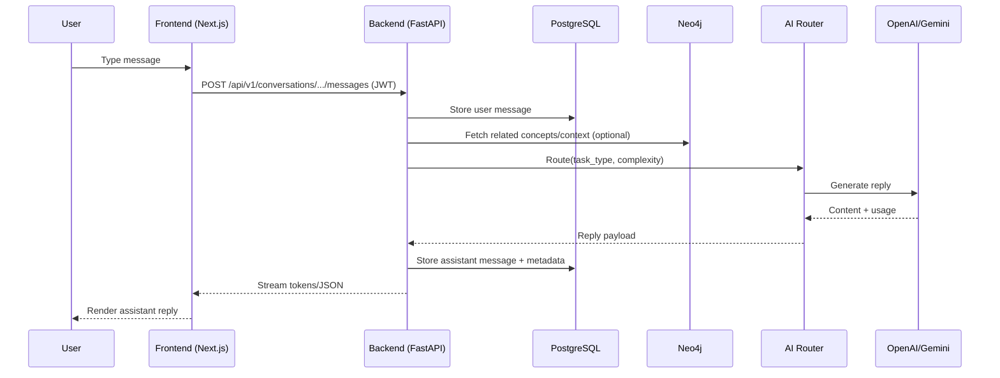
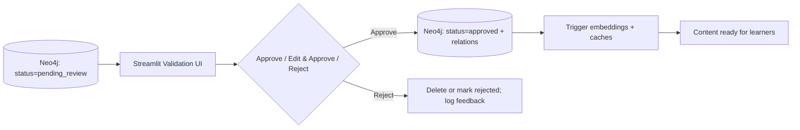

# Process Schema - AI Language Tutor

A concise, editable overview of how the app works end to end.

## 1) System Data Flow (High level)
```mermaid
flowchart TB
  U[User (Web/Mobile)] -->|HTTPS| FE[Next.js Frontend]
  FE -->|JWT auth + REST| BE[FastAPI Backend]
  BE -->|SQL (async)| PG[(PostgreSQL + pgvector)]
  BE -->|Bolt/Cypher| NEO[(Neo4j AuraDB)]
  BE -->|AI routing| AI{AI Providers}
  AI --> OpenAI[OpenAI]
  AI --> Gemini[Google Gemini]
  FE <--> |Web Audio APIs| VOICE[Google Cloud Speech/TTS]
  VAL[Streamlit Validation UI] -->|Cypher| NEO
  VAL -->|Admin/Review APIs| BE
  BE -->|JSON/Stream| FE
```

## 2) Chat Tutoring Round Trip (Sequence)


## 3) Content Analysis -> Knowledge Graph -> Validation
```mermaid
flowchart LR
  SRC[Text / URL / File] --> API[/POST /api/v1/content/analyze-persist/]
  API --> ANALYZE[AI content analysis]
  ANALYZE --> EXTRACT[Extract grammar/vocab + relations]
  EXTRACT --> NEO[(Neo4j: create nodes/edges)]
  NEO --> GATE{Confidence < threshold?}
  GATE -- Yes --> REVIEW[Human validation (Streamlit)]
  GATE -- No --> AUTO[Auto-approve]
  REVIEW --> APPROVE[Approve/Edit + persist relations]
  AUTO --> EMBED
  APPROVE --> EMBED[Generate embeddings (PG/Neo4j)]
  EMBED --> SEARCH[Available for search/learning]
```

## 4) Human Validation Loop (Quality Gate)


## Related Docs
- README.md – Architecture and setup
- PLANNING.md – Full project plan and phases
- AI_ARCHITECTURE.md – AI routing/provider details
- docs/ARCHON_PROJECT_ARCHITECTURE.md – Deep architecture spec


